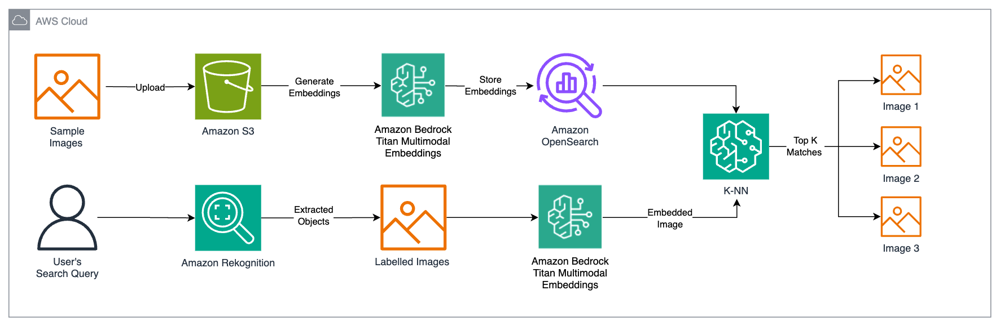

# Build a reverse image search engine with Amazon Rekognition, Amazon OpenSearch Service, and Amazon Titan Multimodal Embeddings in Amazon Bedrock

##### Authors: Nathan Pogue and Waleed Malik

## Introduction

This repository outlines how to build a reverse image search engine to retrieve similar images based on input image queries. This repository will demonstrate a step-by-step guide on how to use the Amazon Titan Multimodal Embedding Model from Amazon Bedrock to embed images, store these embeddings in an Amazon OpenSearch Service Serverless vector index, and use Amazon Rekognition to extract key objects from images for querying the index.

## Solution Overview and Design

The solution design consists of three main phases: data indexing, object detection, and contextual search, as shown in the architecture diagram below:



1. Upload Data to S3: Store the product images in Amazon S3.
2. Generate Embeddings: Use the Amazon Titan Multimodal Embeddings model to generate embeddings for the stored images.
3. Store Embeddings: Ingest the generated embeddings into an Amazon OpenSearch Serverless index, which serves as the vector store for the solution.
4. Image Analysis: Use Amazon Rekognition to analyze the product images and extract labels and bounding boxes for these images. 
5. Convert Search Query to Embeddings: Convert the user's image search query into an embedding using the Amazon Titan Multimodal Embeddings model.
6. Run Similarity Search: Perform a similarity search on the vector database (Amazon OpenSearch Serverless) to find product images that closely match the search query embedding.
7. Display Results: Display the top K similar results to the user.

## Prerequisites

To implement the proposed solution, ensure you have the following:

* An AWS account and a working knowledge of Foundation Models (FMs), Amazon Bedrock, Amazon SageMaker, and OpenSearch Service.
* The Amazon TitanMultimodal Embeddings model enabled in Amazon Bedrock. Verify its status on the Model access page of the Amazon Bedrock console. If enabled, it will display "Access granted".
* A SageMaker Studio domain. If you haven't set up a SageMaker Studio domain, refer to the Amazon SageMaker documentation on setting up SageMaker Studio for individual users.
* An Amazon OpenSearch Serverless Collection.

## Getting Started 

To build out this implementation, follow each step outlined below:

1. Clone this repository into your SageMaker domain.
2. Navigate to the reverse-image-search-engine.ipynb notebook
3. Download the UT Zappos50K dataset and open the Nike folder in the Sneakers and Athletic Shoes subfolder within the Shoes folder. Alternatively, you could upload your own image dataset to the S3 bucket. To upload the images to your S3 bucket, run the following command:

`aws s3 cp /path/to/local/folder s3://your-bucket-name/ —recursive`

4. Set up the SageMaker execution role to have access to the OpenSearch Serverless Collection and vector index. You can grant full access to the OpenSearch index by applying the following IAM policy to the execution role:

```
{
    "Version": "2012-10-17",
    "Statement": [
        {
            "Effect": "Allow",
            "Action": "aoss:*",
            "Resource": "*"
        }
    ]
}
```

5. Run each cell in the notebook to create embeddings, ingest the embeddings, extract out a particular labelled object from a test image you upload, and perform a reverse image search.

## Clean Up

To avoid incurring future charges, delete the resources used in this solution:

1. Delete the OpenSearch Collection vector index.
2. Delete the OpenSearch Serverless collection.
3. Delete the SageMaker resources.
4. Empty and delete the S3 bucket.

## Security

See [CONTRIBUTING](CONTRIBUTING.md#security-issue-notifications) for more information.

## License

This library is licensed under the MIT-0 License. See the LICENSE file.
